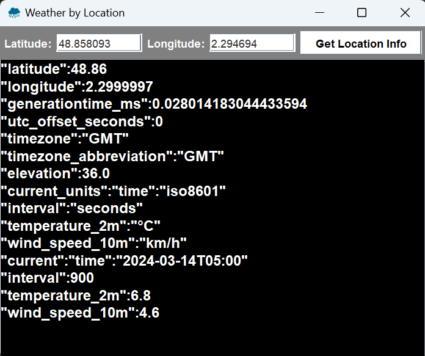

# 2: Weather in a location with Open-Meteo api



This program extends a `JFrame` and allow user to enter location coordinates and recive back the weather in that location. 

This program uses the <a href="https://open-meteo.com/"> Open Meteo API </a> so it require internet connetion.

In the picture we can see the output for the current (at the time the picture was taken)  weather in Eiffel Tower location.

How to run the example:

```console
git clone https://github.com/ip-repo/learning-java.git
cd learning-java/learning-swing/example_2_open_meteo
javac main.java
java main
```

This is the string that define the api call url and you can add parameters and change the request from here.

```Java
String base_url = "https://api.open-meteo.com/v1/forecast?";
String coordinates  = "latitude="  + latitude + "&" + "longitude="+ longitude + "&";
String current = "current=temperature_2m,wind_speed_10m" + "&";
String url_final = base_url + coordinates + current  ;

```
For example here we also ask for the `wind_direction_10m`.
```Java
String current = "current=temperature_2m,wind_speed_10m,wind_direction_10m" + "&";
.
.
.
```
