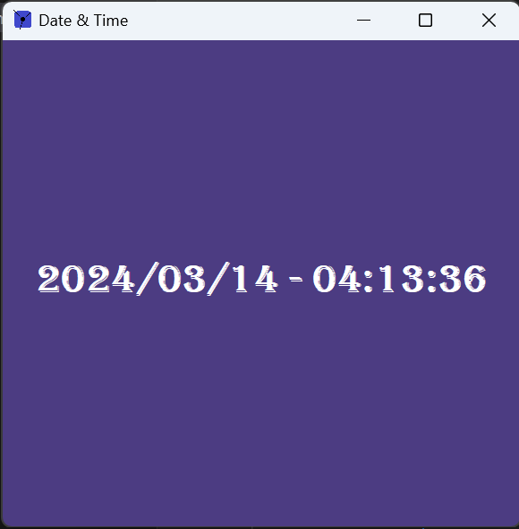

# Swing
### 1: Date and Time program


<a href="https://github.com/ip-repo/learning-java/tree/main/learning-swing/example_1_date_time">This example</a> `extends` a `JFrame` swing object and create a window that has a centred label with the current
date and time.

How to run the example:

```console
git clone https://github.com/ip-repo/learning-java.git
cd learning-java/learning-swing/example_1_date_time
javac Main.java
java Main
```

You can change some settings to get a different program style `DateAndTime.java`:

```Java
//line 23 and 38 : date and time format for example : "... HH:MM ..."
DateTimeFormatter dtf = DateTimeFormatter.ofPattern("yyyy/MM/dd - HH:mm:ss");
//line 26 : Font settings
Font font = new Font("Algerian", Font.BOLD, 30);
//line 32 : label text color
label.setForeground(Color.white);
//line 49 : background color
this.getContentPane().setBackground(new Color(76,60,130));

```
After you have styled the program the way you like you can create a custom command to launch the program.
Lets see how to do that on Windows.

Create a directory lets say `DateAndTime`.
Copy to that directory the files `Main.java` `DateAndTime.java` `icon.png` from the example.
Open a cmd and navigate to `DateAndTime` directory.

```console
cd ..\DateAndTime
javac Main.java
```
Now the command `java Main` will lanuch the program(if you are in the program directory).

Lets create a bat that `cd` into `DateAndTime` directory and then run the command `java Main` and when 
program is terminated the script will go back to the original cmd path.

For example lets create a file named `dateandtime.bat` in `DateAndTime` directory.
```console
@echo off
set "original_dir=%cd%"
cd C:\Full\Path\To\DateAndTime
java main
cd /d "%original_dir%"
@echo on

```
Next we need to let the system enviroment variables to know where to find that bat file `dateandtime.bat`.

Go to-> System properties -> Advanced -> Environment Variables -> Select Path -> Edit -> New ->C:\Full\Path\To\DateAndTime -> OK -> OK

The bat file name `dateandtime` is also the name of the command.

Go ahead and launch a cmd window and type in `dateandtime` you should see the program launched.


